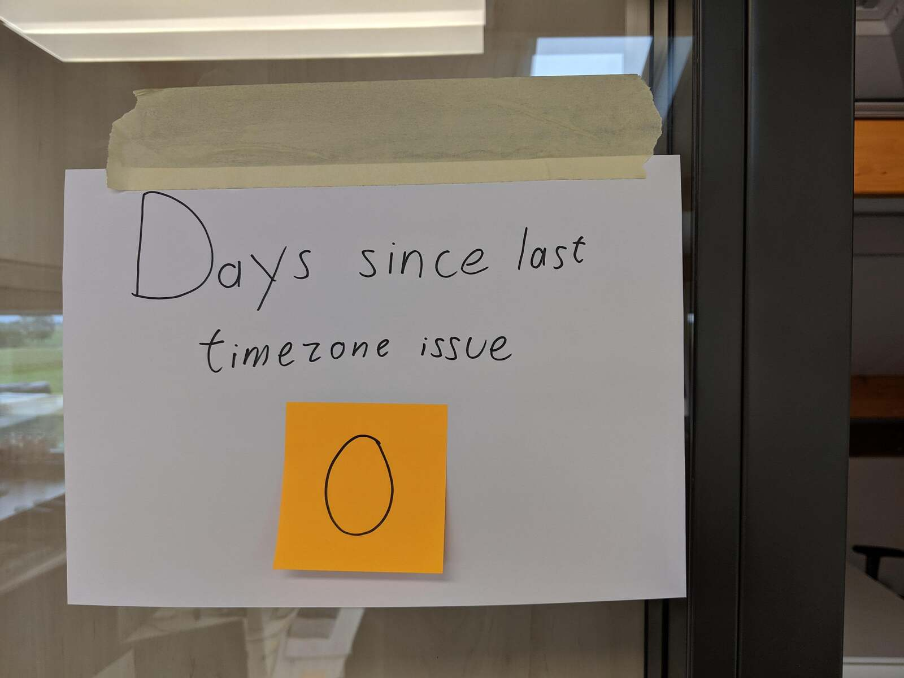

<br/>
<br/>
<br/>
<br/>
<br/>
<br/>
<br/>


# <!-- fit --> TypeDI and vue.js

Volker Braun


---


# About

* Imagine you are organizing a conference
* Problem: get conference data on your web page
* Possibly existing Wordpress page

---

# Step 1: Getting Data

### Have API for looking up

Speaker ID -> Speaker
Lecture ID -> Lecture
...
Sponsor ID -> Sponsor
~~Conference~~ Organization ID -> Conference

And queries...

---

# Data Repository


```ts
class SpeakerCache {

    public load(speaker: SpeakerIdentifier): Promise<Speaker> {
        // load if not cached
    }

    public get(speaker: SpeakerIdentifier): Speaker {
        // return from cache, load if not found not 
    }
}
```

---

<!-- _color: yellow -->


# Manual Wiring


```ts
const httpConnection = new HttpConnection();
const apiRequest = new ApiRequest(httpConnection);
const speakerCache = new SpeakerCache(apiRequest);
const lectureCache = new LectureCache(apiRequest);
const speakersOfLecture =
    new speakersOfLecture(speakerCache, lectureCache);
```

---

# TypeDI Autowiring


```ts
@Service
class SpeakersOfLecture {

    constructor(
        private readonly speakerCache: SpeakerCache,
        private readonly lectureCache: LectureCache,
    ) {}

    public speakersOf(lecture: LectureIdentifier): readonly Speaker[] {
        // yada yada
    }
}
```


---

# TypeDI

### https://github.com/typestack/typedi

* Use type as dependency identifier
* By default, resolved with instance of type
* Can also override (mock services in unit tests)


---
# Annoying Amount of Business Logic

* Sorting (chronological but break ties by room name)
* Filtering (tags, full-text search, state, ...)
* Configuration
* Theming (CSS variables)
* Timezones
* ... wrap it all into services


---
# Timezones

* date-fns is more fun that moment.js

* Pro tip:

  ```ts
  import { format, compareAsc } from 'date-fns'
  
  format(new Date(), 'MM/dd/yyyy');    // '06/11/2020'
  format(new Date(), 'MM/dd/YYYY');    // '06/11/2020'
  ```

* One is calendar year, the other is local week-numbering year. They are almost always the same :dizzy_face:

---


---

# vue.js

* Component consists of
  * HTML template
  * Controller (typescript of course)
  * Style (SCSS)
* Either pasted into single `.vue` file, or separate files

---

# Template syntax


* Moustaches for interpolation
  ```html
  <div>{{ name }}</div>
  ```

* Directives
  ```html
  
  ```

* Directive shorthand
  ```html
  
  ```

---

# Controller

```ts
import { Component, Vue, Prop } from 'vue-property-decorator';

@Component({
    components: { /* that I'm using */ },
})
export default class SpeakerPhoto extends Vue {

    @Prop()
    public readonly speakerId: SpeakerIdentifier;

    public get url(): string {
        // TODO
    }

    public onClick(): void {  /* I was clicked */ }
}
```

---

# No Constructor

* Use lifecycle hooks instead
* No constructor DI


---

# Now you know everything!

* Use component:
  ```html
  <SpeakerPhoto :speaker-id="'xzy123'"></SpeakerPhoto>
  ```
* Complete the loop:
  ```ts
  @Emit()
  public signal(): number {
     return 123;
  }
  ```
  calls method on parent.
---

# Runtime vs Static Type

* Enrich static types with branding:
  ```ts
  type SpeakerIdentifier = String & Brand;
  ```

* Prop does runtime checks, combine with static typing:
  ```ts
  @Prop({ required: true, type: String })
  public readonly speakerId!: SpeakerIdentifier;
  ```

---


# Pet Peeve

* Typing for
  `@Prop({ type: ... })`
  checks constructor signature, which excludes private ctor

* Handy trick to enforce that objects are unique so you can compare with ```===```

---

# Pet Peeve cont'd

* Private constructor
  ```ts
  class Unique {
      private constructor(args) {}
      public static make(args): Unique {
          // return cached if exists for given args, else new Unique(args)
      }
  }
  ```

* Requires cast in the `@Prop` declaration
  ```ts
  @Prop({ required: true, type: Unique as never as Constructor })
  public readonly unique!: Unique;
  ```

---
<!-- _color: white -->


# <!-- fit --> Putting things together


---

# It was… and it was beautiful

```ts
@Component({ })
export default class SpeakerPhoto extends Vue {

    private readonly speakerCache = Container.get(SpeakerCache);
    
    @Prop({ required: true, type: String })
    public readonly speakerId!: SpeakerIdentifier;

    public get url(): string {
        return this.speakerCache.get(this.speakerId).url;
    }
}
```

---

# Nice but I didn't use

npm install vue-typedi

```ts
@Component({ })
export default class SpeakerPhoto extends Vue {

    @Inject()
    private readonly speakerCache!: SpeakerCache;
    
    @Prop({ required: true, type: String })
    public readonly speakerId!: SpeakerIdentifier;

    public get url(): string {
        return this.speakerCache.get(this.speakerId).url;
    }
}
```

---

# Change Detection

* Vue replaces all properties with getters
* On all services injected into the controller
* Getters in the component ("computed properties") are cached and recomputed only if anything used during the evaluation changes
* Can opt-out with `Object.freeze()`

---

# A Challenger Appears

* Works great, but...
* Customer wants plugin multiple times on the same page: Lectures on different days, Speakers, Sponsors, ...


---

# Crazy idea

* Easy: instantiate vue.js on multiple root elements
* Problem: some service hold application state
* Multiple dependency injection containers!
  ```ts
  Container.of('plugin-1').get(LectureFilterState);
  Container.of('plugin-2').get(LectureFilterState);
  ...
  ```
---


# Strange?

```ts
@Service({ global: true })
class LectureCache {
}

@Service
class LectureFilterState {
}
```

Instantiate repository only once, but state once per vue instance

---

# Write a vue.js plugin

* Just a method that is added to each @Component
* ~~Lie to~~ Tell typescript about it
  ```ts
  import Vue, { VueConfiguration } from 'vue/types/vue';
  import { ObjectType } from 'typedi';

  declare module 'vue/types/vue' {
      interface Vue {
          inject<T>(clazz: ObjectType<T>): T;
      }
  }
  ```


---

# Final Version

```ts
@Component({ })
export default class SpeakerPhoto extends Vue {

    private readonly speakerCache = this.inject(SpeakerCache);
    
    @Prop({ required: true, type: String })
    public readonly speakerId!: SpeakerIdentifier;

    public get url(): string {
        return this.speakerCache.get(this.speakerId).url;
    }
}
```


---
<!-- _color: white -->


# <!-- fit --> Demo

---

# FIN

Questions / Comments / Looking for a challenge?


volker.braun@talque.de